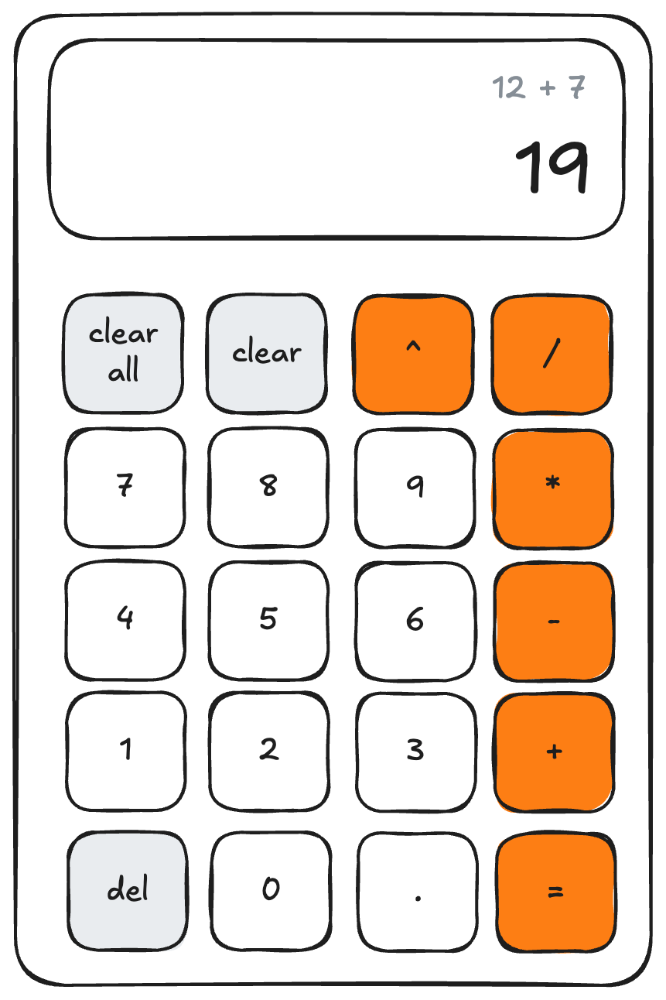

# Minimalistic Calculator

planned:
## Operations
- Addition / Substraction
- Multiplication / Division
- Power

## Delete Buttons
- `del` ... delete digit
- `clear`   ... delete input line
- `clear all`   ... delete input & memory line

## Additional function
- use decimal point `.` for numbers

# Calculator UI
