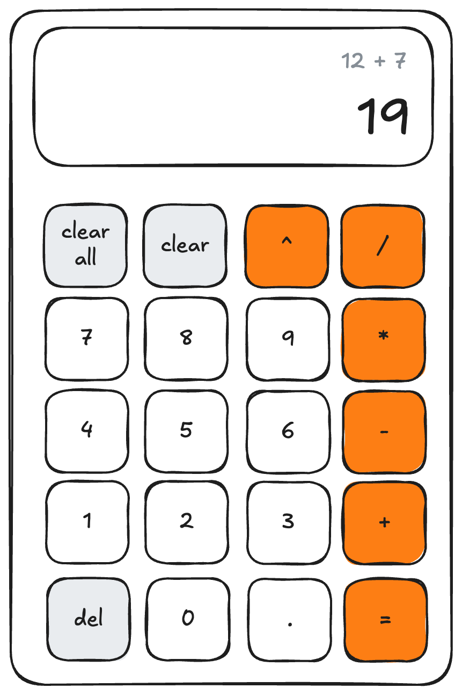

# Calculator

A minimalistic calculator built with vanilla JavaScript, HTML, and CSS.

**[Live Demo](https://kondrashar.github.io/Calculator/)**



## Features

**Operations**
- Addition, subtraction, multiplication, division
- Exponentiation (`^`)
- Decimal point support

**Controls**
- `del` — delete last digit
- `clear` — clear current input
- `clear all` — clear input and memory

**Behavior**
- Chain operations without pressing `=` — intermediate results compute automatically
- Continue calculating from a previous result
- Division by zero protection
- Results rounded to 4 decimal places
- Scrollable input display for long numbers

## Built With

- JavaScript
- CSS
- HTML

## Running Locally

Clone the repo and open `index.html` in your browser:

```bash
git clone https://github.com/KondraShar/Calculator.git
cd Calculator
open index.html
```

## Project Structure

```
├── index.html              # Page layout and button grid
├── calculator.js           # Calculator logic and event handling
├── style.css               # Styling and button animations
├── calculator-ui-design.png  # UI reference screenshot
└── README.md
```